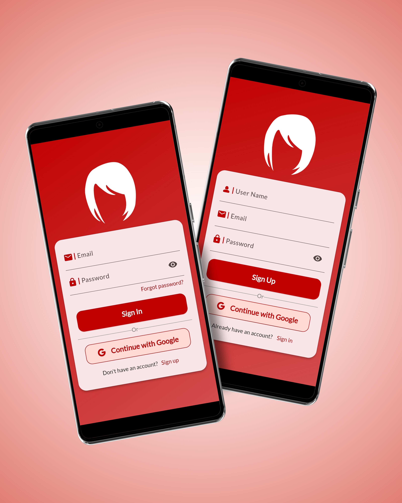
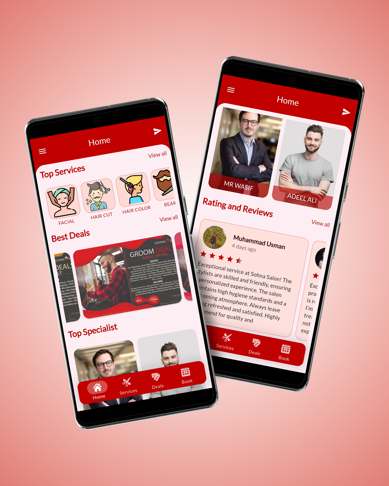
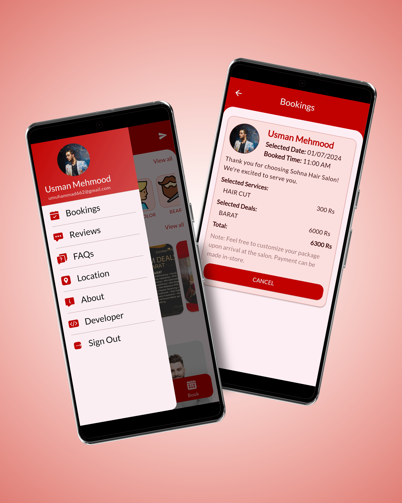
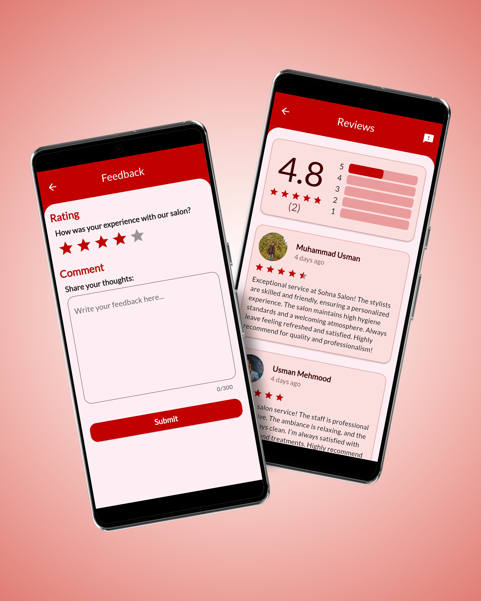

# Sohna Salon App

## My Screens:
  
   
  

  
  
  
  
  
  
  

## Authentication: 
  User login via email/password or Google; splash screen during login and data fetch.

## Home Screen: 
  Custom bottom navigation bar with Home, Deals, Services, and Booking icons. It contains:
  ### Top Services: 
    Horizontally scrollable list of service icons and titles.
  ### Best Deals: 
    Horizontal slider of images.
  ### Top Specialists: 
    Horizontally scrollable list of specialists with names.

## Reviews Screen: 
  Horizontally scrollable customer reviews.

## Deals Screen: 
  Detailed description of deals with images, descriptions, and a "Book Now" button.

## Services Screen:
  Detailed service descriptions, images, prices, and booking options.

## Booking Screen: 
  Select deals/services, choose date/time, and book appointments.

## Drawer Menu: 
  Bookings, Reviews, FAQs, Salon Details, About, Developer Info, and Logout options.

## Backend: 
  Data stored and fetched using Firebase; Stream Provider and RiverPod for data management.
